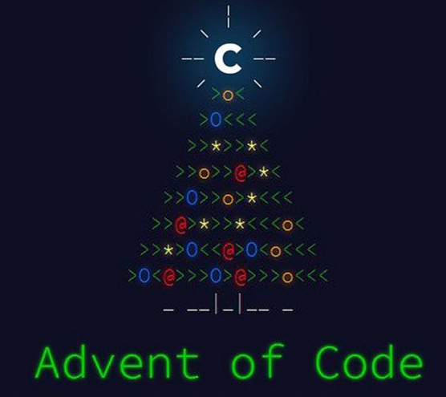

<a name="readme-top"></a>

<!-- PROJECT SHIELDS -->
[![Contributors][contributors-shield]][contributors-url]
[![Forks][forks-shield]][forks-url]
[![Stargazers][stars-shield]][stars-url]
[![Issues][issues-shield]][issues-url]
[![MIT License][license-shield]][license-url]

<!-- PROJECT LOGO -->
<br />
<div align="center">
  <a href="https://github.com/Hekkfern/advent-of-code">
    
  </a>

<h3 align="center">Advent Of Code C++ Challenge</h3>

  <p align="center">
    <i>Advent Of Code</i> solutions made in C++ language
    <br />
    <a href="https://github.com/Hekkfern/advent-of-code/discussions">Discuss</a>
    ·
    <a href="https://github.com/Hekkfern/advent-of-code/issues">Report Bug</a>
  </p>
</div>

<!-- TABLE OF CONTENTS -->
<details>
  <summary>Table of Contents</summary>
  <ol>
    <li>
      <a href="#about-the-project">About The Project</a>
    </li>
    <li>
      <a href="#getting-started">Getting Started</a>
      <ul>
        <li><a href="#prerequisites">Prerequisites</a></li>
        <li><a href="#installation">Installation</a></li>
      </ul>
    </li>
    <li><a href="#usage">Usage</a></li>
    <li><a href="#faq">FAQ</a></li>
    <li><a href="#roadmap">Roadmap</a></li>
    <li><a href="#contributing">Contributing</a></li>
    <li><a href="#license">License</a></li>
    <li><a href="#contact">Contact</a></li>
  </ol>
</details>

<!-- ABOUT THE PROJECT -->

## About The Project

This project has been created with the main goal to provide a easy-to-use development platform to solve [Advent of code](https://adventofcode.com/) puzzles in C++.

Features:

* C++ 20 standard
* Parsing of the input files, so you can use your own data to solve the puzzles.
* `CMake`-based project: feel free to split your logic into several files and classes as you wish.
* Fast compilation with `ccache`
* Use of native CPU instructions to minimize the execution times.
* Quality tools: `clang-tidy`, `cppcheck`, sanitizers, compiler warnings, ...
* `vcpkg` already integrated: import and use any C++ library very easily from the [vcpkg catalog](https://vcpkg.io/en/packages.html).
* CI/CD multi-platform pipelines to validate that everything works as it should in every platform available.
* Unit-testing with `Catch2` library: create unit tests to validate the example inputs, or to validate that your future changes don't break your code.
* Multi-platform: designed to be usable in Windows, Linux and MacOs.
* Dockerization: if you don't want to pollute your computer with all the required development tools, there is a Docker
  image available to start developing in a matter of seconds.

<p align="right">(<a href="#readme-top">back to top</a>)</p>

Tested on:

| Platform | OS                                       | Generator | Cmake version | Compiler                   |
| -------- | ---------------------------------------- | --------- | ------------- | -------------------------- |
| Windows  | Windows 10                               | Ninja     | X.X.X         | MSVC v143                  |
| Linux    | Ubuntu 22.04                             | Ninja     | X.X.X         | GCC X.X.X                  |
| Linux    | Manjaro 22                               | Ninja     | X.X.X         | GCC X.X.X                  |
| Apple    | macOS Monterey 12.6.1  (Intel processor) | Ninja     | 3.25.1        | AppleClang 13.1.6.13160021 |

<!-- GETTING STARTED -->

## Getting Started

This is an example of how you may give instructions on setting up your project locally.
To get a local copy up and running follow these simple example steps.

### Prerequisites

First read [SETUP_DEV_ENVIRONMENT.md](./docs/SETUP_DEV_ENVIRONMENT.md) page to install the necessary tools in your computer to be able to use this project.

### Installation

Clone the repository and all its submodules:

```bash
git clone --recursive https://github.com/Hekkfern/advent-of-code.git
```

<p align="right">(<a href="#readme-top">back to top</a>)</p>

<!-- USAGE INSTRUCTIONS -->

## Usage

### How to use

Read [HOW_TO_USE.md](./docs/HOW_TO_USE.md) page.

### How to add a new *Advent of Code* puzzle

Read [HOW_TO_ADD_NEW_PUZZLE.md](./docs/HOW_TO_ADD_NEW_PUZZLE.md) page.

<p align="right">(<a href="#readme-top">back to top</a>)</p>

### In-deep explanation of how this framework/project works

If you are curious to know how this project has been designed and build, it is suggested to read [HOW_THE_FRAMEWORK_WORKS.md](./docs/HOW_THE_FRAMEWORK_WORKS.md) page.

<!-- FAQ -->

## FAQ

Read [FAQ.md](./docs/FAQ.md) page.

<p align="right">(<a href="#readme-top">back to top</a>)</p>

<!-- ROADMAP -->

## Roadmap

All the pending tasks (and their status) are shown in [@Hekkfern's pending tasks](https://github.com/users/Hekkfern/projects/1) board.

See the [open issues](https://github.com/Hekkfern/advent-of-code//issues) for a list of proposed features (and known issues).

- [Top Feature Requests](https://github.com/Hekkfern/advent-of-code//issues?q=label%3Aenhancement+is%3Aopen+sort%3Areactions-%2B1-desc) (Add your votes using the 👍 reaction)
- [Top Bugs](https://github.com/Hekkfern/advent-of-code//issues?q=is%3Aissue+is%3Aopen+label%3Abug+sort%3Areactions-%2B1-desc) (Add your votes using the 👍 reaction)
- [Newest Bugs](https://github.com/Hekkfern/advent-of-code//issues?q=is%3Aopen+is%3Aissue+label%3Abug)

<p align="right">(<a href="#readme-top">back to top</a>)</p>

<!-- CONTRIBUTING -->

## Contributing

Read [CONTRIBUTING.md](./docs/CONTRIBUTING.md) page.

<p align="right">(<a href="#readme-top">back to top</a>)</p>

<!-- LICENSE -->

## License

Distributed under the MIT License. See [LICENSE](LICENSE) for more information.

<p align="right">(<a href="#readme-top">back to top</a>)</p>

<!-- CONTACT -->

## Contact

If you want to suggest anything or discuss some ideas about this project, feel free to open a topic
in [Discussions](https://github.com/Hekkfern/advent-of-code/discussions)

<p align="right">(<a href="#readme-top">back to top</a>)</p>

<!-- MARKDOWN LINKS & IMAGES -->

[contributors-shield]: https://img.shields.io/github/contributors/Hekkfern/advent-of-code.svg?style=for-the-badge
[contributors-url]: https://github.com/Hekkfern/advent-of-code/graphs/contributors
[forks-shield]: https://img.shields.io/github/forks/Hekkfern/advent-of-code.svg?style=for-the-badge
[forks-url]: https://github.com/Hekkfern/advent-of-code/network/members
[stars-shield]: https://img.shields.io/github/stars/Hekkfern/advent-of-code.svg?style=for-the-badge
[stars-url]: https://github.com/Hekkfern/advent-of-code/stargazers
[issues-shield]: https://img.shields.io/github/issues/Hekkfern/advent-of-code.svg?style=for-the-badge
[issues-url]: https://github.com/Hekkfern/advent-of-code/issues
[license-shield]: https://img.shields.io/github/license/Hekkfern/advent-of-code.svg?style=for-the-badge
[license-url]: https://github.com/Hekkfern/advent-of-code/blob/master/LICENSE.txt
